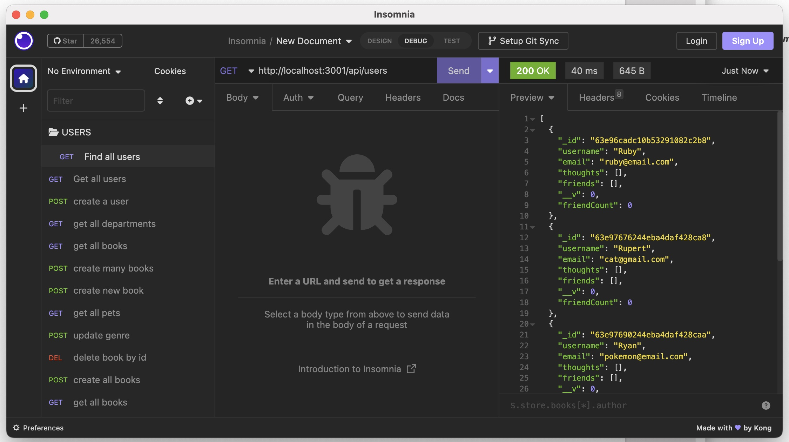
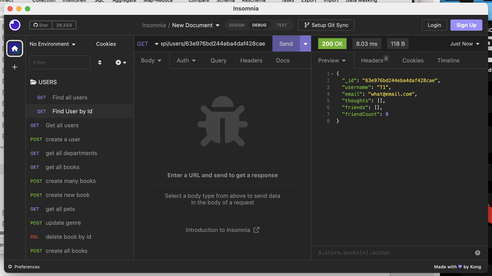
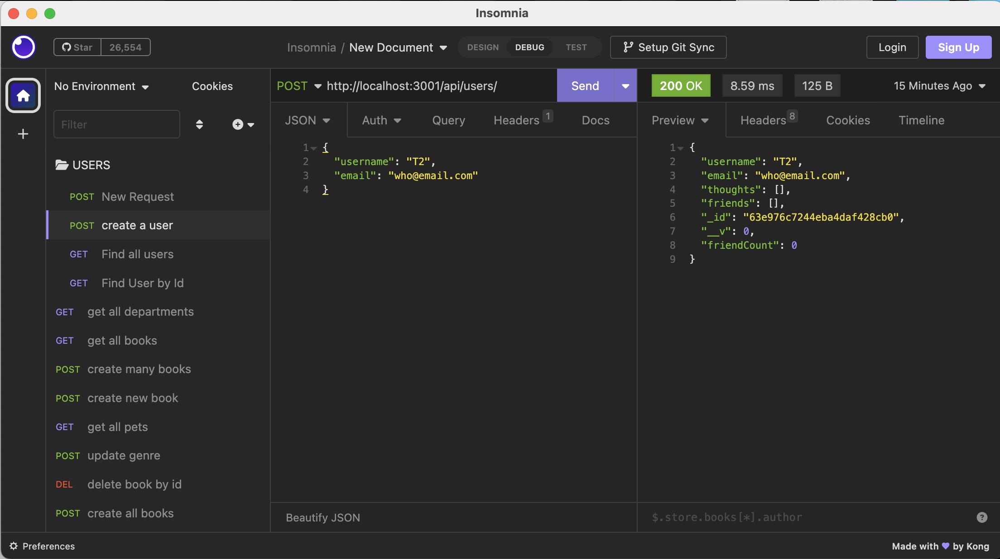
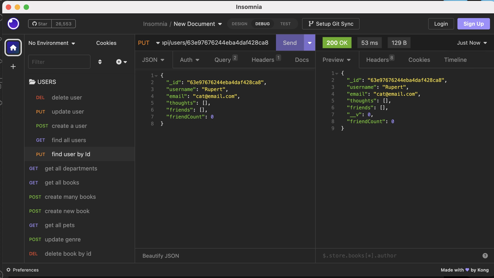

# Social Network Api

Link to video walk through: [https://drive.google.com/file/d/10ynCymeVL_SE2rVWlAW7r1AGhxZgeESK/view](https://drive.google.com/file/d/10ynCymeVL_SE2rVWlAW7r1AGhxZgeESK/view)

## Description
This is an API for a social network web application where users can share their thoughts, react to friends’ thoughts, and create a friend list. 

## Installation
Libraries leveraged include: Express.js for routing, a MongoDB database, and the Mongoose ODM. 
Insomnia was used to check routes and CRUD operations.

## Preview & Usage

1. Install any necessary dependencies, run the following command npm install, npm run start.
2. Open Studio3T and Insomnia.
3. Select the operations you wish to execute (Create-Post, Read-Get, Update-Put, Delete-Delete).
4. Input the appropriate routes needed and send for request and response.
5. Verify the database changes using Studio3T.

Click [here](https://drive.google.com/file/d/10ynCymeVL_SE2rVWlAW7r1AGhxZgeESK/view) to watch a video walk-through.

Some additonal visual examples below.

## License

There were no licenses obtained for this project. For more information on licenses, follow this link:
[https://choosealicense.com/](https://choosealicense.com/).